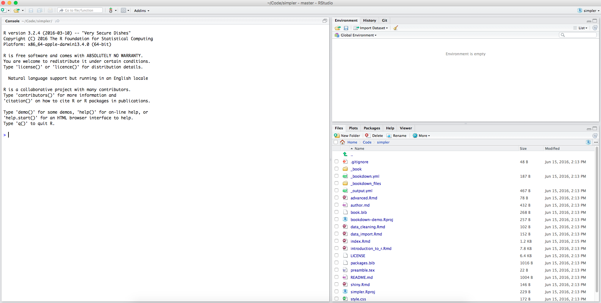

# Introduction to R

## A brief history of splines

The R programming language started off at the University of Auckland, where two statistics professors - Ross Ihaka and Robert Gentleman - found themselves somewhat perturbed by the state of statistical programming. There were a lot of statistical languages and environments out there, but most of the ones they had access to were commercial, requiring you to pay to use them.

In the end they decided to write something themselves, and they called it R (first because it's the first letter in both of their names and second, I hypothesise, because after you've written an entire programming language with one other person you probably don't have the energy left to come up with a fancy name). It was initially used just by the two of them in teaching courses at Auckland, and student complaints were the main source of improvements.

In June 1995, though, everything changed when they released the source code of the language online - and did so under a free license, which let other people reuse the code and crucially *modify* the code. People began submitting their own improvements, new features, and bug fixes, and the language grew and grew. By 2012 it was the most commonly used data science language - a status it [continues to maintain to this day](http://www.kdnuggets.com/2015/05/poll-r-rapidminer-python-big-data-spark.html).

## Why R succeeds

R didn't become popular in a vacuum; there are a lot of other solutions for data analysis out there, some commercial (SAS, SPSS) and some open source (MATLAB, Python, Julia). Despite that, R consistently outstrips them in popularity, and there are a few reasons for that.

***R was written by statisticians***. A lot of programming languages (including statistical ones) are written, unsurprisingly, by programmers - and this is great from a software engineering standpoint. R, however, was written by statisticians, and while this means the language looks slightly strange compared to more "proper" programming languages, it means that it's designed from the ground up to handle the things that statisticians and scientists need.

The primary data formats are tabular, just like the results from scientific experiments tend to be; the language has not only arithmetic support, but also significance tests, general modelling functions and matrix mathematics built in.

***R was written by a community***. As well as the base language, which is the work of many hands, there's also an entire ecosystem of add-ons (which we'll cover later). Put simply: if there's something statistical you need to do, and it isn't in R itself, it's almost *certainly* in an add-on - one that you can obtain, use and include in your work completely free of charge.

***R can do pretty much everything*.** It's primarily a statistical language, but it's not *just* a statistical language. You can do data analysis in it, sure. You can also visualise the results of that analysis in a thousand different ways (including dynamic visualisations), write reports based on it that turn out as LaTeX, PDFs, HTML, or Markdown, or build online dashboards and interactive platforms to display your work.

Heck, you can even build websites in it; I did just to see if I could, and it took 40 lines of code. In that specific case, mind, while you *could* use R, I would strongly recommend you *don't*.

The point, though, is that while R is primarily about statistics, it's a language that covers pretty much every step of handling data, from reading it in and cleaning it up to showing your results to the world.


***R can interact with pretty much everything***. That's a *slight* exaggeration, but only slight. Suppose someone gives you code written in C? R can interact with that. FORTRAN? Yep. C++? Absolutely! And while we're at it, you can link R into Python, JavaScript, Java, Scala, and a whole host of other languages. This means that on the off-chance you encounter something you really need to do that isn't in R, you can integrate it in pretty easily.

There are a lot of other fascinating and wonderful features (some of which we'll cover later on!) but those are the main ones, and why after writing thousands upon thousands of lines of R in the last few years, I'm still so in love with it.

## The R community

One of the things I touched on above - as a reason R is such a powerful and popular environment - is the community. A big benefit is the expertise that community has: for example, the R add-on for neural networks was written by Brian Ripley, a British statistician who quite literally wrote the book on neural networks. Having the person who *invented* the methodology implement it gives you a pretty strong claim to the implementation being reliable.

But another benefit is simply that, while there are dragons in some corners, the community generally consists of people who love expanding what the language can do and how friendly to new users it is - and they practise what they preach! And there are a lot of R programmers, and a lot of places to get help, support, suggestions and pointers. Some venues worth keeping in mind, in case you run into a problem and need some assistance, are:

1. [R on StackOverflow](http://stackoverflow.com/questions/tagged/r);
2. [R's official mailing lists](https://www.r-project.org/mail.html), and;
3. the [R IRC channel](http://webchat.freenode.net/?channels=#R).

## R installation
To get started with R, you're going to need...well, R!

If you're on Windows you can get R [here](https://cran.r-project.org/bin/windows/base/); if you're on an Apple computer, you can download it [here](https://cran.r-project.org/bin/macosx/). For Linux users (specifically Ubuntu users, or people on other, Debian-based distributions) open the terminal and type:

```{r, eval=FALSE}
sudo apt-get -y install r-base
```

This requires the password to your computer's administrator account; if you don't have it, you'll need to get the system administrator to install R.

Once you've got R, you'll also need RStudio - an Integrated Development Environment (IDE) for R that we'll be covering shortly. RStudio can be obtained [here](https://www.rstudio.com/products/rstudio/download/).

After that, you'll need a few R packages (more on those later) that are used in this tutorial. Open RStudio, now that you've installed it, and go to the window in the bottom left marked "console". Type:

```{r, eval=FALSE}
install.packages("readr",
                 "dplyr",
                 "stringr",
                 "tidyr",
                 "lubridate",
                 "readxl",
                 "shiny",
                 "shinydashboard")
```

(Don't worry about what this means right now; we'll get to it later)

## Using RStudio

You should now have RStudio; that's going to be your primary interface for writing R. Let's briefly step through the important bits of the program that you should be paying attention to.

When you open it up there should be three different panes, nestled inside the program, looking something like this:



Let's step through each of them in turn. Going clockwise, we first have the "console": this is a window into which you can type R commands and see the output - we'll be using that a lot. Next over, we've got a pane with two tabs; "Environment" (the default) and "History". "Environment" contains a listing of everything you create during your R tinkering, while "History" provides, well, a history, of the commands you've typed into the console: that way if you need to re-run something, you can find it easily.

And, last but not least down in the bottom right, we have "Files" (which shows your filesystem, so you can find R scripts you've already saved or datasets you want to read in) , "Plots", which will contain any visualisations you generate so that you can prototype them, "Packages", which lists all the R add-ons on your system (and which are loaded), and "Help", which shows any documentation you request.

In practice, another tab will open up when you have an R script open, where the top of "console" is now, and this will contain whatever file(s) you're editing. For now, though, let's focus on the console.

## Tutorial format

Going forward we're going to be focusing on using R, rather than the history, community and everything else. One approach to teaching a programming language is to step through the different rules in how the language is constructed, what the different keywords are, any strange quirks it has, and all the rest - and this can be really helpful for people who are *already* programmers.

That isn't guaranteed, though, and so the rest of this book is divided up into individual, practical applications of the language, combined with explanations of what's going on in each piece so that you can learn the structure of the language through doing.

So, going forward, you'll see something that looks like the following; I'll introduce a concept, or a step in analysing data, and talk about why it's important. And then, after a colon, because I flagrantly abuse both the colon and semicolon:

```{r, eval=FALSE}
There'll be a chunk of code, in a shaded box just like this one,
which will achieve the step I was talking about

# Also there may be lines like this. These are comments, which are ignored by R when code is run.
# They let you document what code is doing within your R program.
```

After that will be an explanation of that chunk of code, and what each bit is doing and how everything in it works.

If you're the sort of person who instead wants to jump into the nitty-gritty of the language, I recommend reading Hadley Wickham's *[Advanced R Programming](http://adv-r.had.co.nz/Data-structures.html)* (specifically the data structures section) to get a handle for the general workings of R, and then coming back here to learn the applications.
